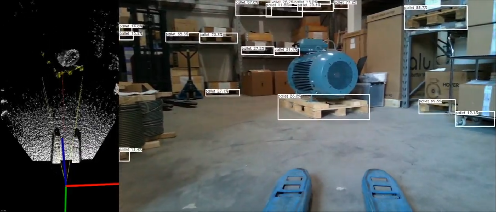
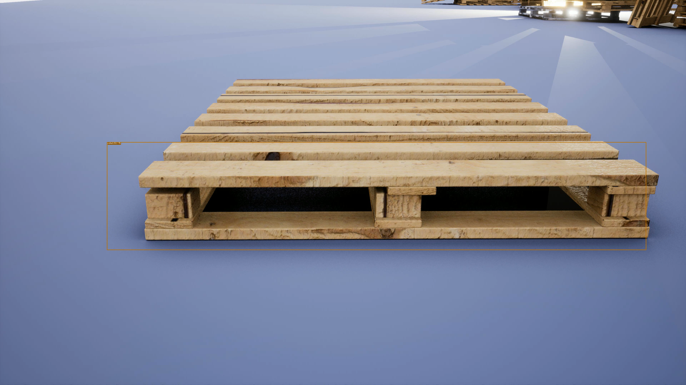
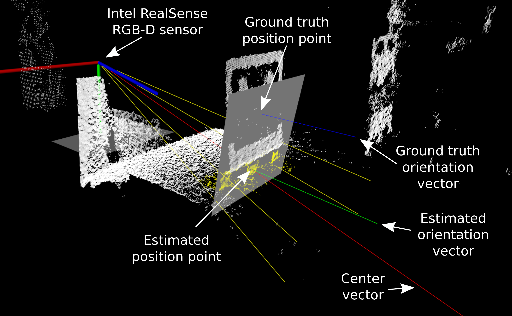
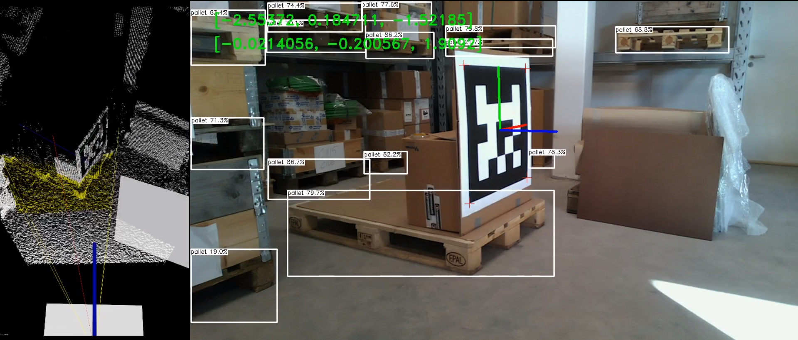
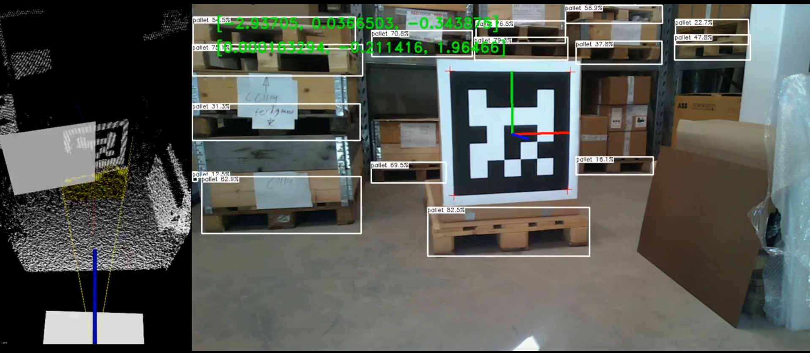

<h1>Real-time Pose Estimation</h1> 

[//]: # ()

[//]: # (## Introduction)

This is part of the master’s thesis: "_A Machine Learning and Point Cloud Processing based Approach for Object Detection 
and Pose Estimation: Design, Implementation, and Validation_", available at [Link to thesis].

By combining an RGB image and point cloud data is the system capable of detecting the object's pose by using object detection,
RANSAC and vector operations. This work is based on the [YOLOX](https://github.com/Megvii-BaseDetection/YOLOX) algorithm and
[Logistics Objects in Context (LOCO)](https://github.com/tum-fml/loco) dataset from 2021 and 2020, respectively.

## Demo Video

<figcaption align = "center"><b><a name="figure_1">Figure 1:</a> Real-time pallet selection with point cloud extraction.</b></figcaption>

## Object Detection

The object detection algorithm is the YOLOX-S model from the [YOLOX](https://github.com/Megvii-BaseDetection/YOLOX) repository, which is transfer learned on the 
[LOCO](https://github.com/tum-fml/loco) dataset. The final version is optimized with [Intel OpenVINO](https://github.com/openvinotoolkit/openvino) and implemented together
with the pose estimation in C++. [Table 1](#table_1) present the YOLOX-S training results for only pallet.

| **Model** | **Parameters** | **Dataset** | **AP** | **AP50** | **AP75** | **AP_S** | **AP_M** | **AP_L** | **Inference time** |
|:---------:|:--------------:|:-----------:|:------:|:--------:|:--------:|:--------:|:--------:|:--------:|:------------------:|
|   YOLOX-S |      9.0 M     |     LOCO    |  24.0% |   53.2%  |   17.2%  |   7.9%   |   24.3%  |   40.6%  |       6.74 ms      |
<figcaption align = "center"><b> <a name="table_1">Table 1:</a> Training results for only pallet's from the LOCO dataset, trained on an NVIDIA GeForce RTX 3060 Laptop GPU.</b></figcaption>

&nbsp;

<figcaption align = "center"><b><a name="figure_2">Figure 2:</a> Synthetic pallet detection video test in Unreal Engine using YOLOX-S trained on the LOCO dataset.</b></figcaption>

&nbsp;

## Pose Estimation
The pose estimation is performed using the object detection algorithm and point cloud data. The object detection is only
the relevant point of the pallet used where two RANSAC operations are performed. The first plane uses only ground floor 
points, while the remaining pallet points are used for the second plane. A center vector from the camera is used to find
the 3D position where the vector intersects the pallet front plane.
While the pallet orientation is directly from the estimated from the front plane.

<figcaption align = "center"><b><a name="figure_3">Figure 3:</a> Vector and point explanation from the PCL 3D viewer.</b></figcaption>

&nbsp;

### Evaluation Demo Video

<figcaption align = "center"><b><a name="figure_4">Figure 4:</a> Real-time moving test evaluated with an AprilTag.</b></figcaption>

&nbsp;

[//]: # (<figcaption align = "center"><b>Figure 2: Realtime pose estimation moving.</b></figcaption>)

<figcaption align = "center"><b><a name="figure_5">Figure 5:</a> Real-time standstill test evaluated with an AprilTag.</b></figcaption>

[//]: # (<figcaption align = "center"><b>Figure 3: Realtime pose estimation standstill.</b></figcaption>)

## Requirements

- realsense2
- OpenCV (contrib)
- InferenceEngine
- ngraph
- PCL

## Future Work

- Improve the robustness of the system.
- Increasing the range of the pose estimation by using only a single plane and not requiring the ground plane.
- Switch between using the ground plane and not.
- Detecting pallet holes.
- Make all the vector operations in a single matrix operation.

## License

[//]: # (All content included in this Git repository is under the license:)

[//]: # ()
[//]: # (Creative Commons Attribution-NonCommercial-ShareAlike 4.0 International)

[//]: # ()
[//]: # (You are free to:)

[//]: # (* <b> Share </b> — copy and redistribute the material in any medium or format)

[//]: # (* <b> Adapt </b> — remix, transform, and build upon the material)

[//]: # ()
[//]: # (Under the following terms:)

[//]: # (* <b> Attribution </b> — You must give appropriate credit, provide a link to the license, and indicate if changes were made. You may do so in any reasonable manner, but not in any way that suggests the licensor endorses you or your use.)

[//]: # (* <b> NonCommercial </b> — You may not use the material for commercial purposes.)

[//]: # (* <b> ShareAlike </b> — If you remix, transform, or build upon the material, you must distribute your contributions under the same license as the original.)

[//]: # (* <b> No additional restrictions </b> — You may not apply legal terms or technological measures that legally restrict others from doing anything the license permits.)

 This work is licensed under a <a rel="license" href="http://creativecommons.org/licenses/by/4.0/">Creative Commons Attribution 4.0 International License</a>.