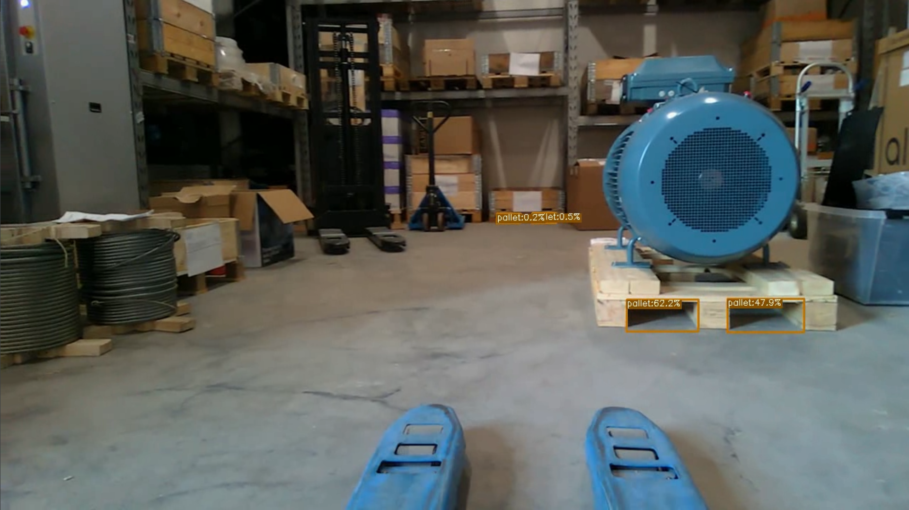

<h1>Real-time Pose Estimation</h1> 

This is part of the master's thesis: "_A Machine Learning and Point Cloud Processing based Approach for Object Detection
and Pose Estimation: Design, Implementation, and Validation_", available at [AURA UiA](https://uia.brage.unit.no/uia-xmlui/handle/11250/3033952).

By combining an RGB image and point cloud data is, the system capable of detecting the object's pose by using object detection,
RANSAC and vector operations within the set requirements. This work is based on the [YOLOX](https://github.com/Megvii-BaseDetection/YOLOX) algorithm and
[Logistics Objects in Context (LOCO)](https://github.com/tum-fml/loco) dataset from 2021 and 2020, respectively.

## Demo Video

<figcaption align = "center"><b><a name="figure_1">Figure 1:</a> Real-time pallet selection with point cloud extraction.</b></figcaption>

[Figure 1](#figure_1) Is a video of the object detection filtering out the pallet of the point cloud. No pose estimation
is performed as the depth data from the Intel RealSense l515 does not capture the ground of the pallet.

## Object Detection

The object detection algorithm is the YOLOX-S model from the [YOLOX](https://github.com/Megvii-BaseDetection/YOLOX) 
repository, which is transfer learned on the [LOCO](https://github.com/tum-fml/loco) dataset. The final version is 
optimized with [Intel OpenVINO](https://github.com/openvinotoolkit/openvino) and implemented together with the pose 
estimation in C++. A total of two models has been created from the pallet dataset and [Table 1](#table_1) present the 
YOLOX-S training results for only pallet and pallet void. [The pytorch weights are available here.](https://mega.nz/folder/jhI11RII#-dDhiLgS3UI2LYpJDjstjw)

<figcaption align = "center"><b> <a name="table_1">Table 1:</a> Training results for only_pallet and pallet_void from the LOCO dataset, trained on an NVIDIA GeForce RTX 3060 Laptop GPU.</b></figcaption>

|      **Model**      | **Parameters** | **Dataset** | **$AP$** | **$AP_{50}$** | **$AP_{75}$** | **$AP_S$** | **$AP_M$** | **$AP_L$** | **Inference time** |
|:-------------------:|:--------------:|:-----------:|:--------:|:-------------:|:--------------:|:----------:|:----------:|:----------:|:------------------:|
| yolox_s_only_pallet |      9.0 M     |     LOCO    |  24.0%   |     53.2%     |     17.2%      |    7.9%    |   24.3%    |   40.6%    |       6.74 ms      |
| yolox_s_pallet_void |      9.0 M     |     LOCO    |   0.2%   |     0.2%      |      0.2%      |    0.0%    |    0.7%    |    0.0%    |       6.96 ms      |

&nbsp;

### Only pallet detection model

A total of 4 485 images are used for training, containing 86 318 annotations of only pallets,
while the validation dataset has a total of 1 006 images and 10 684 annotations. while the validation dataset has a 
total of 1 006 images and 10 684 annotations.

<figcaption align = "center"><b><a name="figure_2">Figure 2:</a> Synthetic pallet detection video test in Unreal Engine using YOLOX-S trained on the LOCO dataset.</b></figcaption>

&nbsp;

[//]: # ([Move the synthetic pallet to other space, methods for improving the model.])

### Only pallet void detection model

<figcaption align = "center"><b><a name="figure_3">Figure 3:</a> Pallet void inference video test using YOLOX-S trained on a pallet void labeled LOCO dataset.</b></figcaption>

&nbsp;

A total of 1900 pallet holes annotations have been manually annotated, refereed to as voids,
split into 1261 training and 639 validation annotations for training. The ML algorithm
manage to detect pallet holes, however with a very low confidence bellow 1%, as shown
in [Figure 3](#figure_3). [CVAT support auto labeling with OpenVINO](https://openvinotoolkit.github.io/cvat/docs/manual/advanced/automatic-annotation/) that speed up the labeling 
process to make the model more confident.

[//]: # (Since the pallet void dataset only contain)

[//]: # (1900 pallet void annotations compared to 120 000 pallet annotations in the complete LOCO)

[//]: # (dataset [34], is it recommended by [59] to do more augmentation during training to improve)

[//]: # (the model.)

## Pose Estimation
The pose estimation is performed using the object detection algorithm and point cloud data.

Object detection filters out only the relevant points of the pallet where two RANSAC operations are performed.
The first plane uses only ground floor points, while the remaining pallet points are used for the second plane.
A center vector from the camera is used to find the 3D position where the vector intersects the pallet front plane, 
while the pallet orientation is directly from the estimated front plane. [Figure 4](#figure_4) explains the system 
outputs in the PCL viewer.

<figcaption align = "center"><b><a name="figure_4">Figure 4:</a> Vector and point explanation from the PCL 3D viewer.</b></figcaption>

&nbsp;

### Evaluation Demo Video

The evaluation of the pose estimation system is done with an AprilTag (Type: 25h9), which can directly output its pose using
functions from the OpenCV contrib library. A total of two tests have been performed. Moving test where the camera rotates
around from 0 to -90 degrees and a standstill test where accuracy and precision are evaluated.
The distance from the pallet is two-meter for both tests. [Figure 5](#figure_5) and [Figure 6](#figure_6) links to a video.

<figcaption align = "center"><b><a name="figure_5">Figure 4:</a> Real-time moving test evaluated with an AprilTag.</b></figcaption>

&nbsp;

<figcaption align = "center"><b><a name="figure_6">Figure 5:</a> Real-time standstill test evaluated with an AprilTag.</b></figcaption>

## Requirements

<figcaption align = "center"><b> <a name="table_2">Table 2:</a> Required library packages.</b></figcaption>

| **Package**     | **Minimum version** | **Info**                                                                                |
|-----------------|---------------------|-----------------------------------------------------------------------------------------|
| realsense2      | 2.50.0              | From the [Intel® RealSense™ SDK 2.0](https://github.com/IntelRealSense/librealsense).   |
| OpenCV          | 4.2.0               | [OpenCV_contib](https://github.com/opencv/opencv_contrib) is required for aruco module. |
| InferenceEngine | 2021.4.752          | From the [OpenVINO toolkit](https://github.com/openvinotoolkit/openvino).               |
| ngraph          | N/A                 | Required for InferenceEngine, and part of openVINO.                                     |
| PCL             | 1.10.0              | From [PointCloudLibrary/pcl](https://github.com/PointCloudLibrary/pcl).                 |

## Future Work

- Improve the robustness of the system by implementing 
- Increasing the range of the pose estimation by using only a single plane and not requiring the ground plane
 (Dynamic depending on number of remaining points after extraction). 
- Detecting pallet holes.
- Make all the vector operations in a single matrix operation.
- Add configuration.
- Add [TensorRT](https://github.com/NVIDIA/TensorRT) based object detection class library for optimized inference on NVIDIA hardware.

## Known Issues

- The colors in the image sometimes switch between RGB and BGR. Unknown if this is an issue in the code or in 
 the imported rosbag. The issue is shown in the [demo at 01:26](https://youtu.be/HvKInx1uoBw?t=86). 
